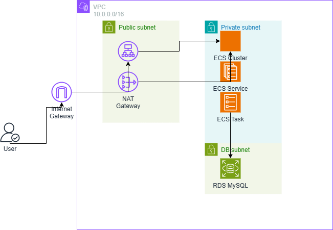

# AWS ECS Fargate Infrastructure Architecture

このプロジェクトは、AWS上で高可用性のあるWebアプリケーションを構築するためのTerraformコードです。以下の構成図は、VPC、サブネット、ALB、ECS Fargate、RDSデータベース、NAT Gateway、インターネットゲートウェイなどのコンポーネントを示しています。

## 構成図

architecture-phase5-2.drawio を draw.io (https://app.diagrams.net/) で開き、PNGとしてエクスポートして `architecture-phase5-2.png` を作成してください。

## コンポーネントの説明

- **VPC**: CIDRブロック 10.0.0.0/16
  - **Public Subnets**:
    - 10.0.1.0/24 (us-west-2a)
    - 10.0.2.0/24 (us-west-2b)
  - **Private Subnets** (ECS Fargate Task用):
    - 10.0.11.0/24 (us-west-2a)
    - 10.0.12.0/24 (us-west-2b)
  - **DB Subnets** (RDS用):
    - 10.0.21.0/24 (us-west-2a)
    - 10.0.22.0/24 (us-west-2b)

- **インターネットゲートウェイ**: インターネットからのアクセスを許可
- **NAT Gateway**: Privateサブネットからのアウトバウンドトラフィックを許可 (各AZに1つ)

- **Application Load Balancer (ALB)**:
  - 配置: Public Subnets
  - ポート: 80 (HTTP)
  - セキュリティグループ: ALB-SG (ポート80 オープン)

- **ECS Fargate**:
  - 配置: Private Subnets
  - クラスター: ECS Cluster
  - サービス: ECS Service
  - タスク定義: ECS Task Definition
  - コンテナ: Dockerイメージ (app/index.html)
  - ポート: 80 (HTTP)
  - セキュリティグループ: ECS-SG (ALBからのポート80のみ許可)

- **RDS (MySQL)**:
  - 配置: DB Subnets
  - エンジン: MySQL 8.0
  - インスタンスタイプ: db.t3.micro
  - ポート: 3306
  - セキュリティグループ: DB-SG (ECS-SGからのポート3306のみ許可)

## 通信の流れ

1. ユーザーのリクエスト (HTTP) → インターネットゲートウェイ → ALB (ポート80)
2. ALB → ECS Fargate Task (ポート80)
3. ECS Fargate Task → RDS (ポート3306) (データベースアクセス)
4. ECS Fargate Task → NAT Gateway → インターネット (アウトバウンドトラフィック、例: パッケージ更新)

## セキュリティグループ

- **ALB-SG**: ポート80を全世界から許可
- **ECS-SG**: ポート80をALB-SGからのみ許可
- **DB-SG**: ポート3306をECS-SGからのみ許可

各セキュリティグループの境界は構成図で点線で表現されています。

## 構築手順

1. Terraformをインストール
2. `infrastructure/` ディレクトリで `terraform init` を実行
3. `terraform plan` で変更を確認
4. `terraform apply` でインフラを構築

## 注意事項

- この構成は開発/テスト環境向けです。本番環境では追加のセキュリティ対策（HTTPS、WAFなど）を検討してください。
- RDSのパスワードはAWS Secrets Managerで管理されています。